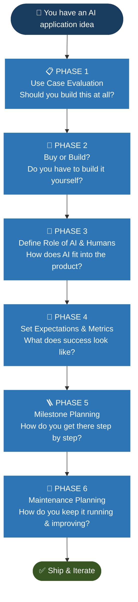
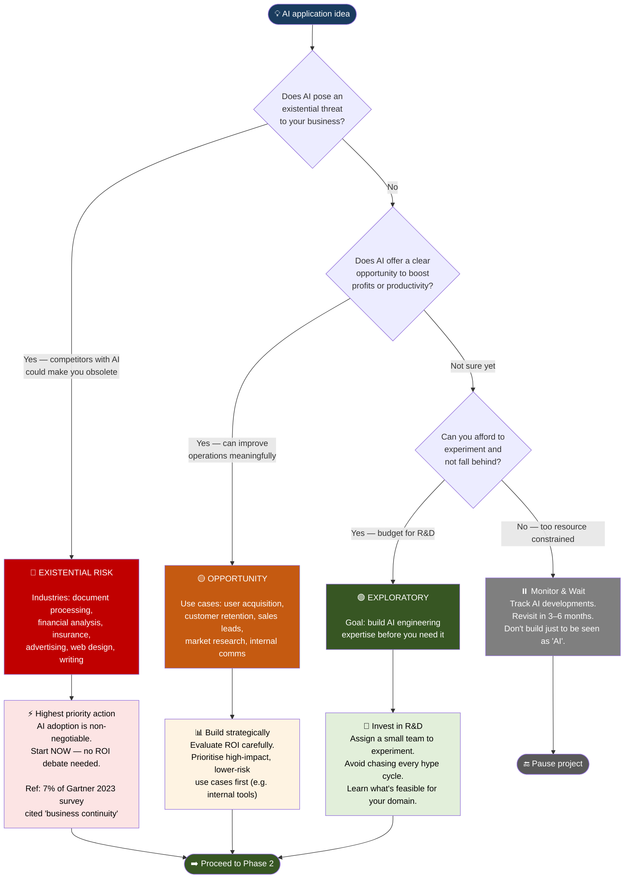
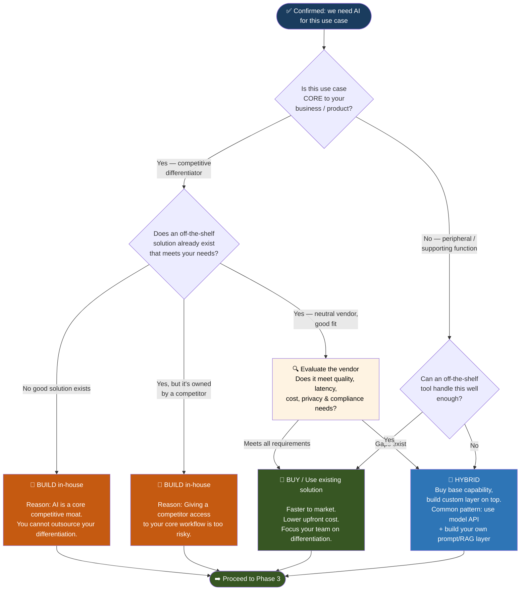
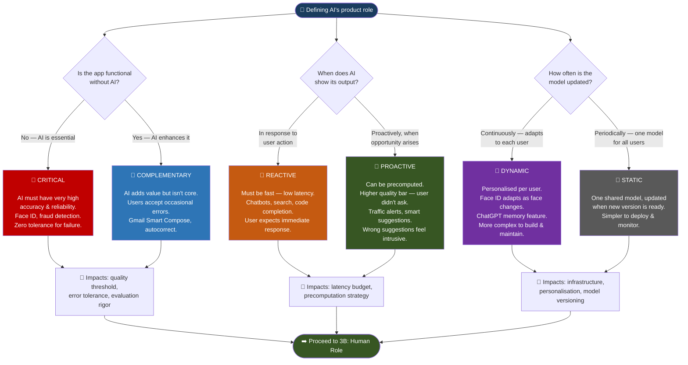
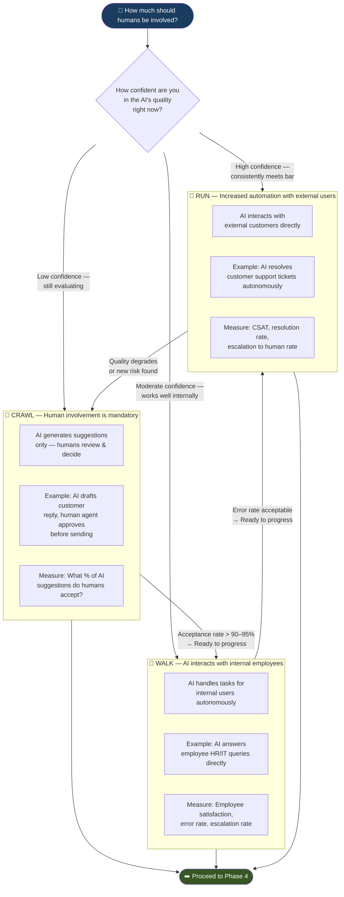
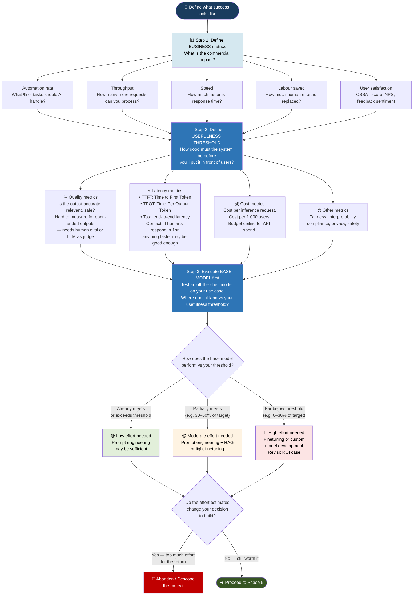
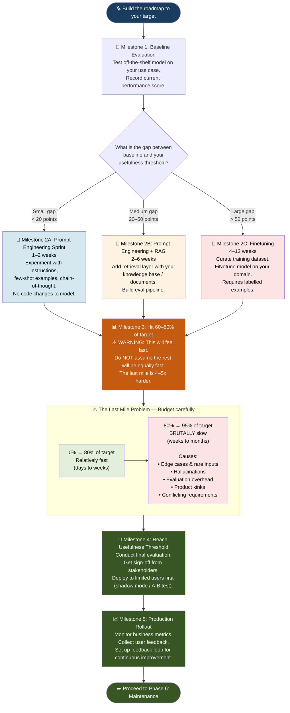
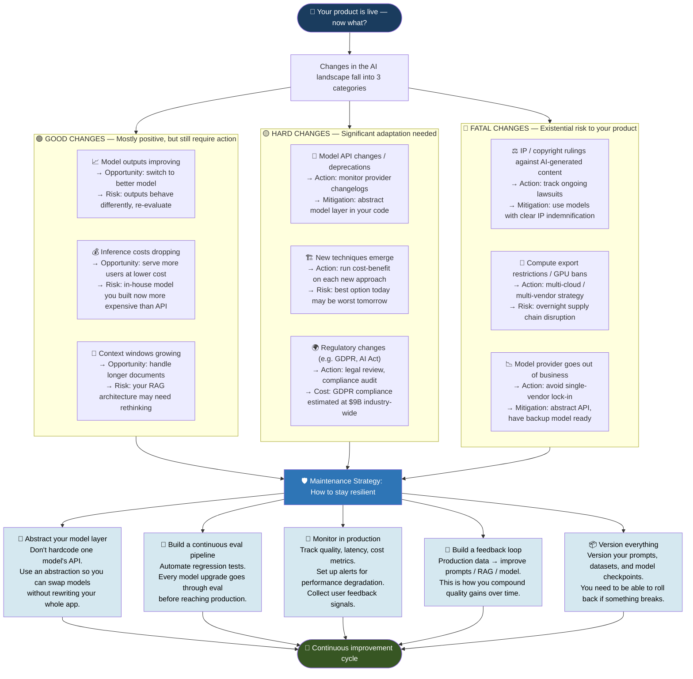
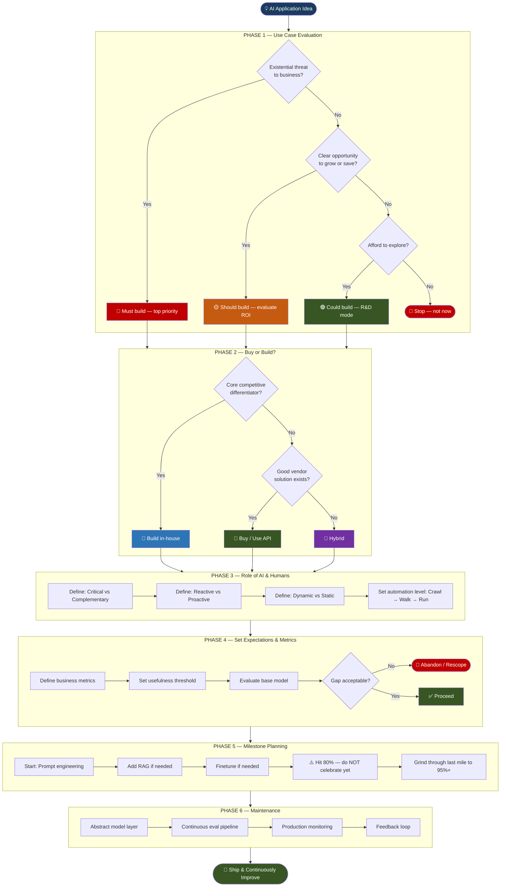

# 🗺️ Planning AI Applications — Structured Step-by-Step Guide

> 📖 **Source:** *AI Engineering: Building Applications with Foundation Models* by **Chip Huyen** (O'Reilly Media, Chapter 1, p. 28–35)

---

## 📋 Table of Contents

- [Overview: The Complete Planning Flow](#-overview-the-complete-planning-flow)
- [Phase 1 — Use Case Evaluation](#phase-1--use-case-evaluation-should-you-build-this)
- [Phase 2 — Buy or Build?](#phase-2--buy-or-build)
- [Phase 3 — Define the Role of AI & Humans](#phase-3--define-the-role-of-ai--humans-in-the-application)
- [Phase 4 — Setting Expectations & Metrics](#phase-4--setting-expectations--metrics)
- [Phase 5 — Milestone Planning](#phase-5--milestone-planning)
- [Phase 6 — Maintenance Planning](#phase-6--maintenance-planning)
- [Complete End-to-End Decision Map](#-complete-end-to-end-decision-map)

---

## 🔭 Overview: The Complete Planning Flow

> There are **6 sequential phases** to planning an AI application properly.
> Most people skip to Phase 5. Don't be most people.



---

## Phase 1 — Use Case Evaluation: Should You Build This?

> 📖 *Chip Huyen, AI Engineering, Chapter 1, p. 29*
>
> *"If you're doing this for a living, it might be worthwhile to take a step back and consider why you're building this."*

The first question is not *how* to build — it's *why*. Every AI project starts from one of three motivations, each with a different urgency level.



### Phase 1 Summary Table

| Risk Level | Trigger | Urgency | Example Industries |
|-----------|---------|---------|-------------------|
| 🔴 **Existential** | AI could make your core business obsolete | Immediate — no debate | Document processing, financial analysis, insurance, advertising |
| 🟡 **Opportunity** | AI can meaningfully boost profits or productivity | High — build strategically | Most businesses — sales, support, content, operations |
| 🟢 **Exploratory** | Don't want to be left behind like Kodak / Blockbuster | Moderate — R&D budget | Large enterprises with dedicated R&D teams |
| ⏸️ **Wait** | Too resource-constrained and no immediate threat | Low — monitor | Early-stage startups, resource-constrained teams |

> 📖 *Chip Huyen, AI Engineering, Chapter 1, p. 29*

---

## Phase 2 — Buy or Build?

> 📖 *Chip Huyen, AI Engineering, Chapter 1, p. 29–30*
>
> *"Once you've found a good reason to develop this use case, you might consider whether you have to build it yourself."*



> **Key insight from the book:** The low entry barrier to AI is a *double-edged sword*. If it's easy for you to build, it's easy for competitors too. Ask yourself: what's your **moat**? Is it technology, proprietary data, or distribution?

> 📖 *Chip Huyen, AI Engineering, Chapter 1, p. 31–32*

---

## Phase 3 — Define the Role of AI & Humans in the Application

> 📖 *Chip Huyen, AI Engineering, Chapter 1, p. 30–31*
>
> This phase has **two parallel decisions** to make: (A) the product role of AI, and (B) the level of human involvement.

### 3A — What is AI's Role in the Product?



### 3B — The Human-in-the-Loop Decision (Microsoft Crawl-Walk-Run)

> 📖 *Chip Huyen, AI Engineering, Chapter 1, p. 31 — citing Microsoft (2023)*



> **Rule of thumb:** If 95% of AI-suggested responses to simple requests are used by human agents verbatim → consider letting AI respond directly to those request types.

> 📖 *Chip Huyen, AI Engineering, Chapter 1, p. 31*

---

## Phase 4 — Setting Expectations & Metrics

> 📖 *Chip Huyen, AI Engineering, Chapter 1, p. 32–33*
>
> *"The most important metric is how this will impact your business."*



### Metrics Quick Reference

| Metric Category | What to measure | Example targets |
|----------------|----------------|-----------------|
| **Quality** | Accuracy, relevance, safety, hallucination rate | >90% correctness on eval set |
| **Latency — TTFT** | Time to first token (streaming perception) | <500ms for chat interfaces |
| **Latency — TPOT** | Time per output token | <50ms/token |
| **Latency — Total** | End-to-end response time | <5s for most use cases |
| **Cost** | Per-request API / compute cost | <$0.01 per customer interaction |
| **Automation rate** | % of tasks AI handles without human | >60% for support chatbot |
| **User satisfaction** | CSAT, NPS, thumbs up/down | CSAT >4.0/5.0 |

> 📖 *Chip Huyen, AI Engineering, Chapter 1, p. 32–33*

---

## Phase 5 — Milestone Planning

> 📖 *Chip Huyen, AI Engineering, Chapter 1, p. 33–34*
>
> *"It might take a weekend to build a demo but months, and even years, to build a product."*



### The Last Mile — Time Budget Reality Check

| Stage | Typical Time | Feel |
|-------|-------------|------|
| 0% → 60% | Days to 1–2 weeks | 🟢 Fast & exciting — demo ready |
| 60% → 80% | 2–4 weeks | 🟡 Slowing down — edge cases appear |
| 80% → 90% | 4–8 weeks | 🔴 Grinding — each % gain is hard-won |
| 90% → 95% | 8–16 weeks | 🔴 Very slow — hallucinations, rare inputs dominate |
| 95% → 99% | Months+ | 🔴 May require model retraining or architecture changes |

> *"LinkedIn found it took one month to achieve 80% of the experience — then four more months to get to 95%."*
> — Chip Huyen, AI Engineering, Chapter 1, p. 33–34

> 📖 *Chip Huyen, AI Engineering, Chapter 1, p. 33–34*

---

## Phase 6 — Maintenance Planning

> 📖 *Chip Huyen, AI Engineering, Chapter 1, p. 34–35*
>
> *"Building on top of foundation models today means committing to riding this bullet train."*



> 📖 *Chip Huyen, AI Engineering, Chapter 1, p. 34–35*

---

## 🗺️ Complete End-to-End Decision Map

> The full planning journey on a single flowchart — use this as a quick-reference map.



---

## 📝 Summary: The 6-Phase Planning Checklist

```
PHASE 1 — USE CASE EVALUATION
  ☐ Identify your motivation: Existential / Opportunity / Exploratory
  ☐ Validate the business case before writing a single line of code
  ☐ Ask: what happens if a competitor builds this and you don't?

PHASE 2 — BUY OR BUILD?
  ☐ Determine if AI is a core competitive differentiator
  ☐ Survey existing vendors and open-source models
  ☐ Assess defensibility: technology moat, data moat, or distribution moat

PHASE 3 — ROLE OF AI & HUMANS
  ☐ Classify: Critical vs Complementary
  ☐ Classify: Reactive vs Proactive
  ☐ Classify: Dynamic vs Static
  ☐ Set initial automation level: start at CRAWL, plan path to RUN

PHASE 4 — EXPECTATIONS & METRICS
  ☐ Define business metrics (automation rate, speed, cost, CSAT)
  ☐ Set a clear usefulness threshold before building
  ☐ Evaluate the base model first — record the baseline score
  ☐ Revisit the ROI case if the gap is too large

PHASE 5 — MILESTONE PLANNING
  ☐ Start with prompt engineering (fastest, cheapest)
  ☐ Add RAG if model needs external / proprietary knowledge
  ☐ Plan finetuning only if prompt engineering + RAG aren't enough
  ☐ Budget 4–5x more time for the last 20% of quality improvement
  ☐ Do not demo to stakeholders at 80% and promise 100% in 2 weeks

PHASE 6 — MAINTENANCE
  ☐ Abstract your model layer — avoid hard lock-in to one provider
  ☐ Build a continuous evaluation pipeline from day one
  ☐ Set up production monitoring (quality, latency, cost)
  ☐ Design a feedback loop so production data improves the system
  ☐ Version prompts, datasets, and model checkpoints
  ☐ Track regulatory developments in your region / industry
```

---

> 📖 **All content sourced from:**
> *Chip Huyen, AI Engineering: Building Applications with Foundation Models — Chapter 1, p. 28–35 (O'Reilly Media)*
